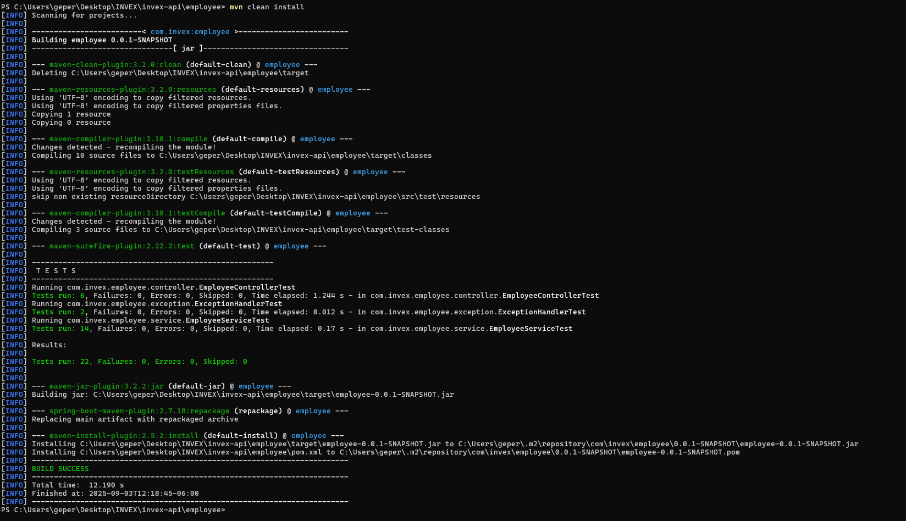
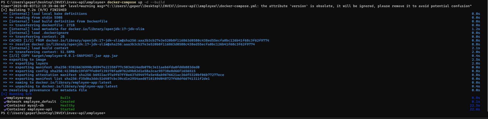
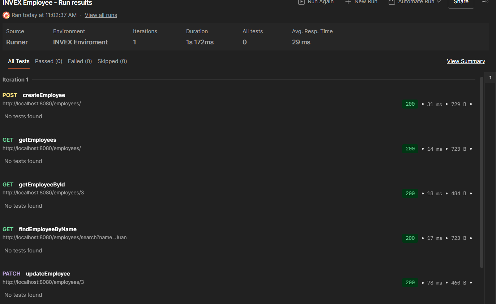
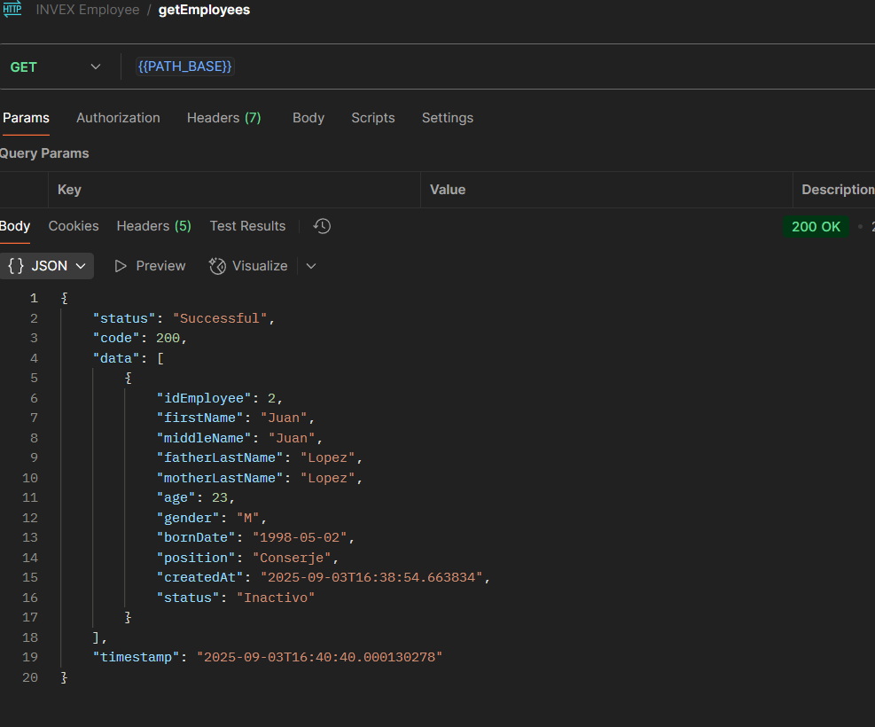
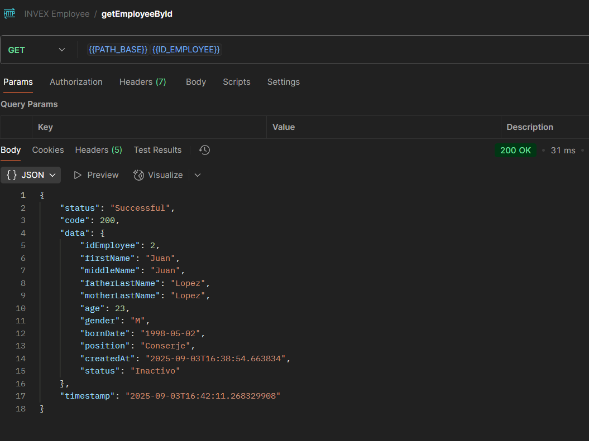
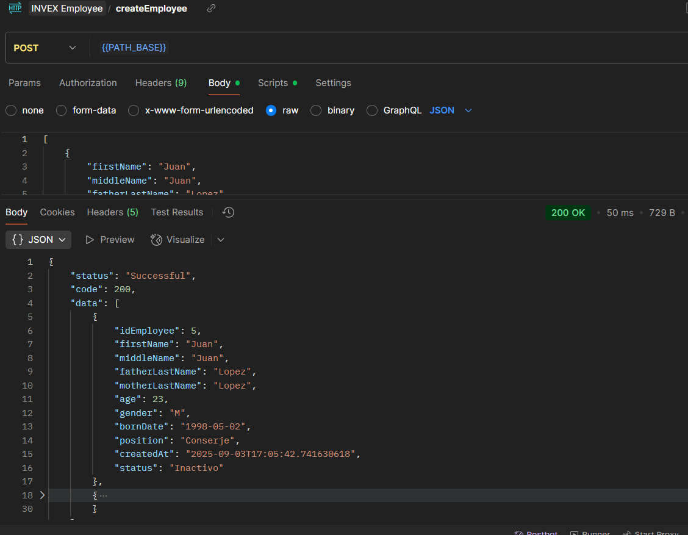
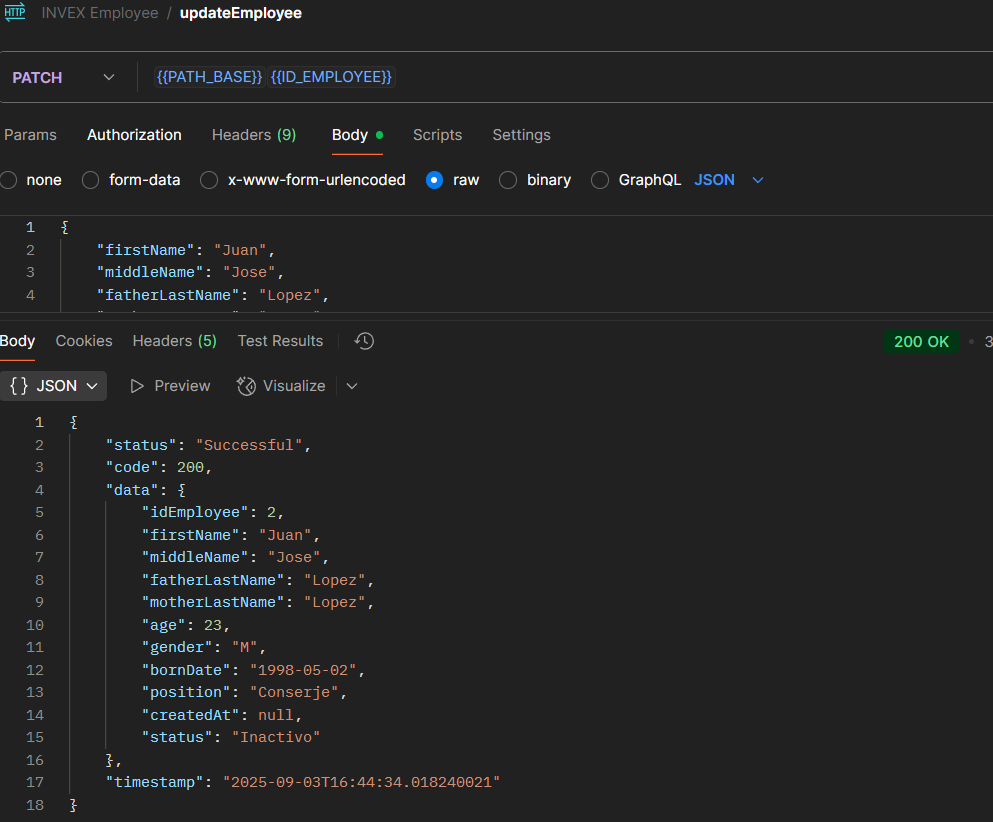
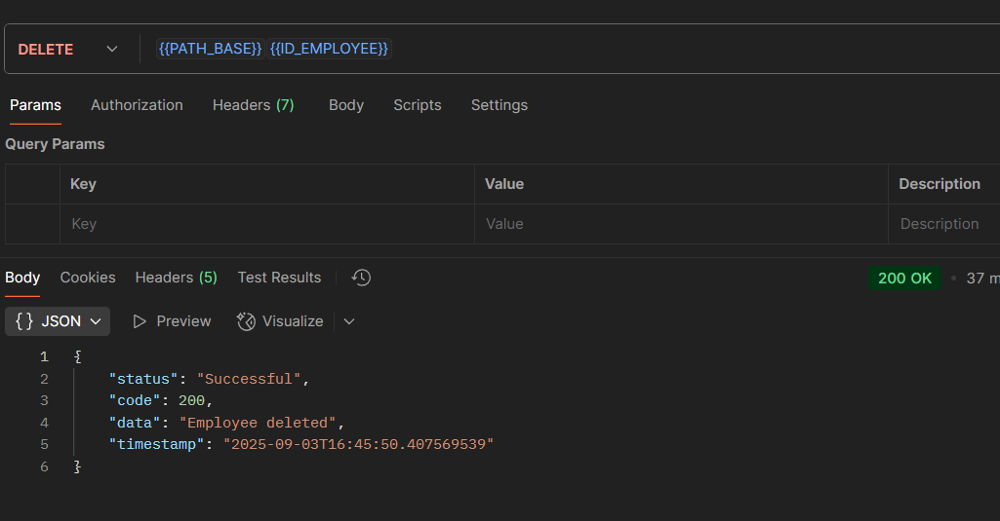
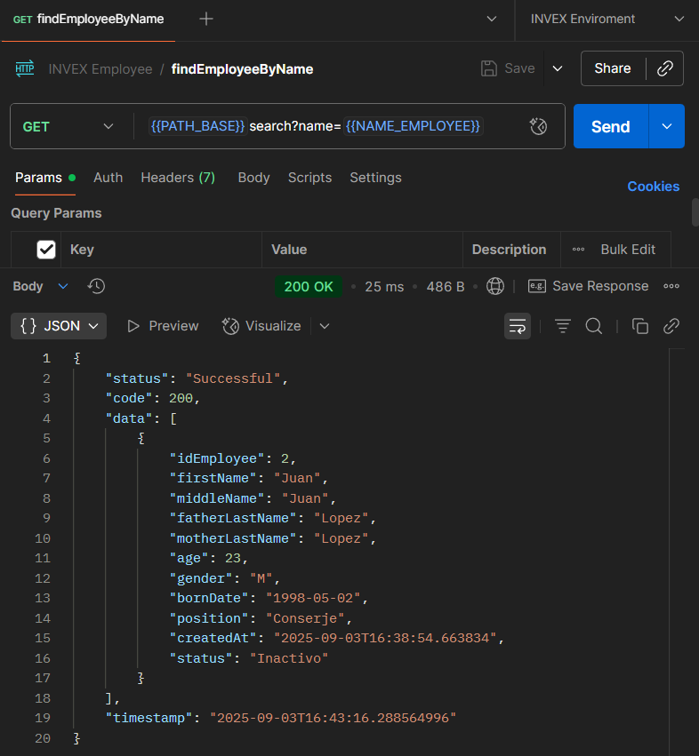

# Employee API

API REST para gestión de empleados, construida con **Spring Boot**, **Spring Data JPA**, **MySQL** y **Docker**.

---

## 🛠 Tecnologías

- Java 17
- Spring Boot 2.7.18
- Spring Data JPA
- MySQL 8
- Docker / Docker Compose
- Lombok
- Springdoc OpenAPI (Swagger UI)

---

## 🚀 Endpoints útiles

### 1️⃣ OpenAPI / Swagger UI

- La documentación interactiva está disponible en:
  http://localhost:8080/swagger-ui

### 2️⃣ Actuator

- Para monitoreo y health checks: http://localhost:8080/actuator/health

### 3️⃣ Postman

- Puedes importar una **colección de Postman** para probar todos los endpoints:
  - GET /employees
  - GET /employees/{id}
  - POST /employees
  - PATCH /employees/{id}
  - DELETE /employees/{id}
  - GET /employees/search?name={name}

---

## 📁 Estructura del proyecto
        employee/
        ├── src/ # Código fuente
        ├── target/ # JAR generado por Maven
        ├── Dockerfile # Para construir la imagen de la app
        ├── docker-compose.yml # Para levantar API + MySQL
        ├── application.properties
        └── pom.xml

---

## ⚙️ Instalación

1. Clonar el repositorio:

```bash
git clone https://github.com/edwingerardoperezcruz/invex-employee
cd invex-employee

mvn clean install

docker-compose up --build
```



## 🚀 Ejecución y Pruebas Funcionales

- Se realizaron pruebas funcionales para los siguientes requerimientos:
  - GET /employees: Devuelve el listado de todos los empleados registrados.

  - GET /employees/{id}: Recupera el detalle de un empleado por su ID.

  - POST /employees: Permite insertar uno o varios empleados en una misma petición.

  - PUT /employees/{id}: Actualiza todos o algunos de los campos de un empleado.

  - DELETE /employees/{id}: Elimina un empleado por su ID.

  - GET /employees/search?name={name}: Buscar empleados por nombre (búsqueda parcial).


  

1. GET /employees: Devuelve el listado de todos los empleados registrados.

    


2. GET /employees/{id}: Recupera el detalle de un empleado por su ID.
    


3. POST /employees: Permite insertar uno o varios empleados en una misma petición.



4. PUT /employees/{id}: Actualiza todos o algunos de los campos de un empleado.
    


6. DELETE /employees/{id}: Elimina un empleado por su ID.



7. GET /employees/search?name={name}: Buscar empleados por nombre (búsqueda parcial).
    
